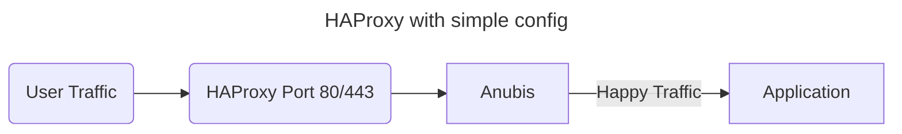
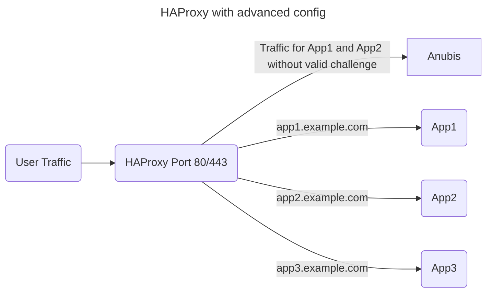

# HAProxy

To use Anubis with HAProxy, you have two variants:
  - simple - stick Anubis between HAProxy and your application backend (simple)
    - perfect if you only have a single application in general
  - advanced - force Anubis challenge by default and route to the application backend by HAProxy if the challenge is correct
    - useful for complex setups
    - routing can be done in HAProxy
    - define ACLs in HAProxy for domains, paths etc which are required/excluded regarding Anubis
    - HAProxy 3.0 recommended

## Simple Variant

Your Anubis env file configuration may look like this:

import simpleAnubis from "!!raw-loader!./haproxy/simple-config.env";

<CodeBlock language="bash">{simpleAnubis}</CodeBlock>

The important part is that `TARGET` points to your actual application and if Anubis and HAProxy are on the same machine, a UNIX socket can be used.

Your frontend and backend configuration of HAProxy may looke like the following:

import simpleHAProxy from "!!raw-loader!./haproxy/simple-haproxy.cfg";

<CodeBlock language="bash">{simpleHAProxy}</CodeBlock>

This simply enables SSL offloading, sets some useful and required headers and routes to Anubis directly.

## Advanced Variant

Due to the fact that HAProxy can decode JWT, we are able to verify the Anubis token directly in HAProxy and route the traffic to the specific backends ourselves.

In this example are three applications behind one HAProxy frontend. Only App1 and App2 are secured via Anubis; App3 is open for everyone. The path `/excluded/path` can also be accessed by anyone.

:::note

For an improved JWT decoding performance, it's recommended to use HAProxy version 3.0 or above.

:::

Your Anubis env file configuration may look like this:

import advancedAnubis from "!!raw-loader!./haproxy/advanced-config.env";

<CodeBlock language="bash">{advancedAnubis}</CodeBlock>

It's important to use `HS512_SECRET` which HAProxy understands. Please replace `<SECRET-HERE>` with your own secret string (alphanumerical string with 128 characters recommended).

You can set Anubis to force a challenge for every request using the following policy file:

import advancedAnubisPolicy from "!!raw-loader!./haproxy/advanced-config-policy.yml";

<CodeBlock language="yaml">{advancedAnubisPolicy}</CodeBlock>

The HAProxy config file may look like this:

import advancedHAProxy from "!!raw-loader!./haproxy/advanced-haproxy.cfg";

<CodeBlock language="haproxy">{advancedHAProxy}</CodeBlock>

Please replace `<SECRET-HERE>` with the same secret from the Anubis config.