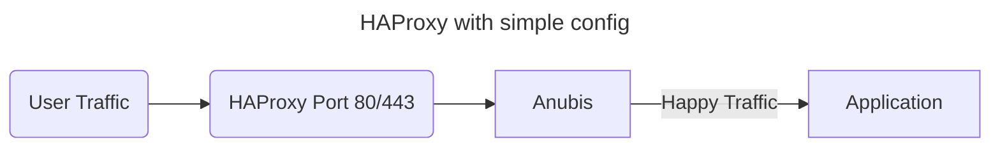
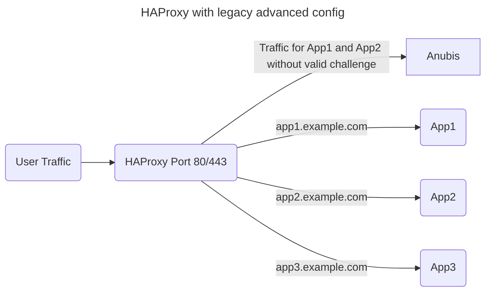

# HAProxy

import CodeBlock from "@theme/CodeBlock";

To use Anubis with HAProxy, you have two variants:
  - simple - stick Anubis between HAProxy and your application backend (simple)
    - perfect if you only have a single application in general
  - advanced - uses SPOE to verify the cookie against haproxy
    - routing happens in haproxy
    - requests only touch anubis if a challenge is required
  - advanced legacy - force Anubis challenge by default and route to the application backend by HAProxy if the challenge is correct
    - requires the policy to be completely written in HAProxy config
    - HAProxy 3.0 recommended

## Simple Variant

```mermaid
---
title: HAProxy with simple config
---
flowchart LR
    T(User Traffic)
    HAProxy(HAProxy Port 80/443)
    Anubis
    Application

    T --> HAProxy
    HAProxy --> Anubis
    Anubis --> |Happy Traffic| Application
```

Your Anubis env file configuration may look like this:

import simpleAnubis from "!!raw-loader!./haproxy/simple/env";

<CodeBlock language="bash">{simpleAnubis}</CodeBlock>

The important part is that `TARGET` points to your actual application and if Anubis and HAProxy are on the same machine, a UNIX socket can be used.

Your frontend and backend configuration of HAProxy may look like the following:

import simpleHAProxy from "!!raw-loader!./haproxy/simple/haproxy.cfg";

<CodeBlock language="bash">{simpleHAProxy}</CodeBlock>

This simply enables SSL offloading, sets some useful and required headers and routes to Anubis directly.

## Advanced Variant

To avoid proxying already validated requests through Anubis, HAProxy can be connected using the SPOP protocol.
For Details on SPOE see HAProxy documentation: https://github.com/haproxy/haproxy/blob/master/doc/SPOE.txt

HAProxy SPOE Terminology detour:
* SPOE - Stream Processing Offload Engine - i.e. the implementation in HAProxy
* SPOA - Stream Processing Offload Agent - the program HAProxy is communicating with, in this case Anubis
* SPOP - Stream Processing Offload Protocol - The Protocol between the two

Example setup:
```mermaid
---
title: HAProxy with simple config
---
flowchart LR
    T(User Traffic)
    HAProxy(HAProxy Port 80/443)
    B1(App1)
    B2(App2)
    B3(App3)
    Anubis

    T --> HAProxy
    HAProxy --> | Traffic for App1 and App2 without valid challenge (Port HTTP/8923) | Anubis
    HAProxy --> | Cookie Validation and Policy evaluation (Port SPOE/9000) | Anubis
    HAProxy --> | app1.example.org | B1
    HAProxy --> | app2.example.org | B2
    HAProxy --> | app3.example.org | B3
    Anubis --> | OG Metadata fetches | HAProxy
```

When a new request comes in, HAProxy will first forward the anubis cookie together with all request metadata to anubis. Anubis then makes a decision
and reports this decision to HAProxy in the form of a status code. The status code currently can take one of the following values:
* 0: A rule within anubis has matched which permits this request through without verification
* 1: The client has a valid cookie, no further verification is needed
* 2: The client should be denied access to the service entirely
* 3: The client needs verification should be routed to anubis to perform this verification
* 255: An error occurred within anubis. Check anubis logs for more details

Most users will want to treat code 0 and 1 identically (by passing the request to the backend) as well as the two error conditions (code 255 and no code set).
Furthermore, it can be useful to set the backend service of anubis to the haproxy ingress, in order to allow OG Passthrough to work. The ACL should exclude localhost from anubis in this case

This offers major advantages over using anubis in the traditional way for anyone using haproxy.
* Users can take full advantage of HAProxys load balancing features, without having to route a request through it twice
* Anubis is not part of the data path, reducing load on the system
* Allow requests to pass through in case anubis breaks/overloads or other unforeseen events, like the dog eating the server cable

If HAProxy and Anubis are hosted on the same machine, it is recommended to use a UNIX domain instead of a TCP/IP socket for SPOP and HTTP communication.

The Env File looks like this. Please note that the TARGET is set to HAProxy's HTTP port, so it can fetch opengraph tags.
`localhost` is therefore explicitly excluded from any anubis lookup to prevent loops:

import advancedSpoeAnubis from "!!raw-loader!./haproxy/advanced-spoe/env";

<CodeBlock language="bash">{advancedSpoeAnubis}</CodeBlock>

The Main HAProxy configuration looks like this:

import advancedSpoeHAProxy from "!!raw-loader!./haproxy/advanced-spoe/haproxy.cfg";

<CodeBlock language="haproxy">{advancedSpoeHAProxy}</CodeBlock>

Additionally, there is an SPOA configuration at `/etc/haproxy/anubis.cfg`:

import advancedSpoeAgent from "!!raw-loader!./haproxy/advanced-spoe/anubis.cfg";

<CodeBlock language="haproxy">{advancedSpoeAgent}</CodeBlock>

## Old Advanced Variant

Due to the fact that HAProxy can decode JWT, we are able to verify the Anubis token directly in HAProxy and route the traffic to the specific backends ourselves.
This Option works just fine and does not use the SPOE integration of HAProxy, with the disadvantage that Anubis cannot apply its ruleset.

In this example are three applications behind one HAProxy frontend. Only App1 and App2 are secured via Anubis; App3 is open for everyone. The path `/excluded/path` can also be accessed by anyone.

```mermaid
---
title: HAProxy with legacy advanced config
---

flowchart LR
    T(User Traffic)
    HAProxy(HAProxy Port 80/443)
    B1(App1)
    B2(App2)
    B3(App3)
    Anubis

    T --> HAProxy
    HAProxy --> |Traffic for App1 and App2 without valid challenge| Anubis
    HAProxy --> |app1.example.com | B1
    HAProxy --> |app2.example.com| B2
    HAProxy --> |app3.example.com| B3
```

:::note

For an improved JWT decoding performance, it's recommended to use HAProxy version 3.0 or above.

:::

Your Anubis env file configuration may look like this:

import advancedAnubis from "!!raw-loader!./haproxy/advanced/env";

<CodeBlock language="bash">{advancedAnubis}</CodeBlock>

It's important to use `HS512_SECRET` which HAProxy understands. Please replace `<SECRET-HERE>` with your own secret string (alphanumerical string with 128 characters recommended).

You can set Anubis to force a challenge for every request using the following policy file:

import advancedAnubisPolicy from "!!raw-loader!./haproxy/advanced/policy.yml";

<CodeBlock language="yaml">{advancedAnubisPolicy}</CodeBlock>

The HAProxy config file may look like this:

import advancedHAProxy from "!!raw-loader!./haproxy/advanced/haproxy.cfg";

<CodeBlock language="haproxy">{advancedHAProxy}</CodeBlock>

Please replace `<SECRET-HERE>` with the same secret from the Anubis config.
