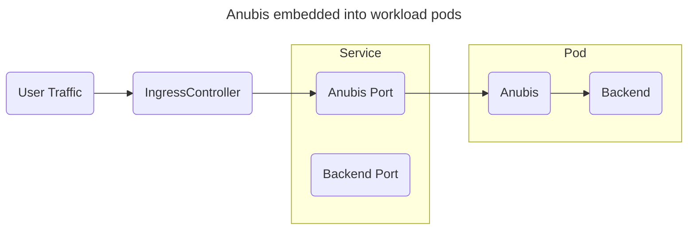

# Kubernetes

:::note
Leave the `PUBLIC_URL` environment variable unset in this sidecar/standalone setup. Setting it here makes redirect construction fail (`redir=null`).
:::

When setting up Anubis in Kubernetes, you want to make sure that you thread requests through Anubis kinda like this:



Anubis is lightweight enough that you should be able to have many instances of it running without many problems. If this is a concern for you, please check out [ingress-anubis](https://github.com/jaredallard/ingress-anubis?ref=anubis.techaro.lol) or [anubis-kubernetes-operator](https://github.com/eznix86/anubis-kubernetes-operator/?ref=anubis.techaro.lol)

This example makes the following assumptions:

- Your target service is listening on TCP port `5000`.
- Anubis will be listening on port `8080`.

Adjust these values as facts and circumstances demand.

Create a secret with the signing key Anubis should use for its responses:

```
kubectl create secret generic anubis-key \
  --namespace default \
  --from-literal=ED25519_PRIVATE_KEY_HEX=$(openssl rand -hex 32)
```

Attach Anubis to your Deployment:

```yaml
containers:
  # ...
  - name: anubis
    image: ghcr.io/techarohq/anubis:latest
    imagePullPolicy: Always
    env:
      - name: "BIND"
        value: ":8080"
      - name: "DIFFICULTY"
        value: "4"
      - name: ED25519_PRIVATE_KEY_HEX
        valueFrom:
          secretKeyRef:
            name: anubis-key
            key: ED25519_PRIVATE_KEY_HEX
      - name: "METRICS_BIND"
        value: ":9090"
      - name: "SERVE_ROBOTS_TXT"
        value: "true"
      - name: "TARGET"
        value: "http://localhost:5000"
      - name: "OG_PASSTHROUGH"
        value: "true"
      - name: "OG_EXPIRY_TIME"
        value: "24h"
    resources:
      limits:
        cpu: 750m
        memory: 256Mi
      requests:
        cpu: 250m
        memory: 256Mi
    securityContext:
      runAsUser: 1000
      runAsGroup: 1000
      runAsNonRoot: true
      allowPrivilegeEscalation: false
      capabilities:
        drop:
          - ALL
      seccompProfile:
        type: RuntimeDefault
```

Then add a Service entry for Anubis:

```yaml
# ...
spec:
  ports:
    # diff-add
    - protocol: TCP
      # diff-add
      port: 8080
      # diff-add
      targetPort: 8080
      # diff-add
      name: anubis
```

Then point your Ingress to the Anubis port:

```yaml
rules:
  - host: git.xeserv.us
    http:
      paths:
        - pathType: Prefix
          path: "/"
          backend:
            service:
              name: git
              port:
                # diff-remove
                name: http
                # diff-add
                name: anubis
```

## Storage

By default, Anubis stores all of its data in memory. This memory is not shared between pods. If you have multiple instances of Anubis without the data being [stored outside of memory](../policies.mdx#storage-backends) and a [shared cookie key](../installation.mdx#key-generation), you will run into [unexpected behaviour](https://github.com/TecharoHQ/anubis/issues/1602) when user traffic traverses between pods.

Based on the deployment of your Kubernetes cluster, here are the preferable storage backends to pick from:

| Backend  | Pro                                                             | Con                                                                                          |
| :------- | :-------------------------------------------------------------- | :------------------------------------------------------------------------------------------- |
| `bbolt`  | Only requires a ReadWriteOnce PVC.                              | Does not support more than one Anubis pod.                                                   |
| `memory` | Requires no configuration.                                      | Process memory is not shared between pods.                                                   |
| `s3api`  | Great if your cluster includes Rook/Ceph to use RADOS directly. | Potentially higher latency unless you use a store like [Tigris](https://www.tigrisdata.com). |
| `valkey` | Trivial to configure in your cluster.                           | If your Redis/Valkey server is down, Anubis is going to have issues.                         |

Pick your poison accordingly. Many production deployments use the `s3api` and `valkey` backends without issue. Single node deployments can get away with either `memory` or `bbolt` depending on the facts and circumstances of the deployment.

## Envoy Gateway

If you are using envoy-gateway, the `X-Real-Ip` header is not set by default, but Anubis does require it. You can resolve this by adding the header, either on the specific `HTTPRoute` where Anubis is listening, or on the `ClientTrafficPolicy` to apply it to any number of Gateways:

HTTPRoute:

```yaml
apiVersion: gateway.networking.k8s.io/v1
kind: HTTPRoute
metadata:
  name: app-route
spec:
  hostnames: ["app.domain.tld"]
  parentRefs:
    - name: envoy-external
      namespace: network
      sectionName: https
  rules:
    - backendRefs:
        - identifier: *app
          port: anubis
      filters:
        - type: RequestHeaderModifier
          requestHeaderModifier:
            set:
              - name: X-Real-Ip
                value: "%DOWNSTREAM_REMOTE_ADDRESS_WITHOUT_PORT%"
```

Applying to any number of Gateways:

```yaml
apiVersion: gateway.envoyproxy.io/v1alpha1
kind: ClientTrafficPolicy
metadata:
  name: envoy
spec:
  headers:
    earlyRequestHeaders:
      set:
        - name: X-Real-Ip
          value: "%DOWNSTREAM_REMOTE_ADDRESS_WITHOUT_PORT%"
  clientIPDetection:
    xForwardedFor:
      trustedCIDRs:
        - 10.96.0.0/16 # Cluster pod CIDR
  targetSelectors: # These will apply to all Gateways
    - group: gateway.networking.k8s.io
      kind: Gateway
```
